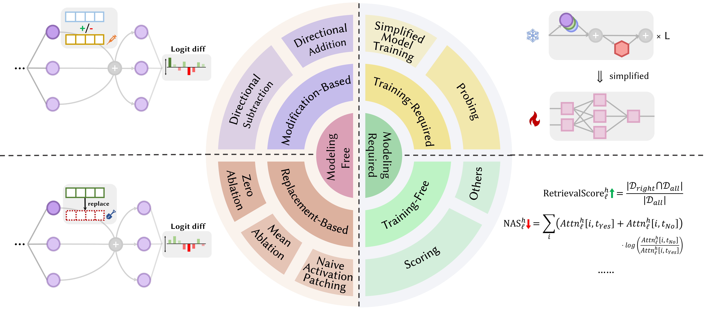

<h2 align='center'> Attention Heads of Large Language Models: A Survey (Awesome Attention Heads) </h2>

    <!-- Awesome badges-->
    
    <!-- arxiv badges -->
    
    <!-- hf -->
    
    <!-- Last commit -->
    

<!-- 

    

        <a href="https://github.com/fan2goa1">Zifan Zheng</a>1*, 
        <a href="https://github.com/wyzh0912">Yezhaohui Wang</a>1*, 
        <a href="https://github.com/saythe17">Yuxin Huang</a>2*, 
        <a href="https://github.com/Ki-Seki">Shichao Song</a>1, 
        Bo Tang1,
        Feiyu Xiong1,
        Zhiyu Li1†
    

    

        1<a href="https://www.iaar.ac.cn/">Institute for Advanced Algorithms Research (IAAR), Shanghai</a>,  
        2<a href="https://air.tsinghua.edu.cn">Institute for AI Industry Research (AIR), Tsinghua University</a>
    

 -->

<!-- 

*Equal contribution.
 
†Corresponding author: Zhiyu Li (<a href="mailto:lizy@iaar.ac.cn">lizy@iaar.ac.cn</a>).

 -->

> \[!IMPORTANT\]
>
> - 🌟 **Star Us!** If you find our work helpful, please consider staring our GitHub to stay updated with the latest content in this Awesome repo!
> 
> - About this repo. This is a platform to get the **latest research** on different kinds of LLM's Attention Heads. Also, we released a survey based on these fantastic works.
>
> - If you want to **cite our work**, here is our bibtex entry: [CITATION.bib](./CITATION.bib).
>
> - If you only want to see the related **paper list**, please jump directly to [here](#lastest-papers).

## 📢 News
- **[2024/09/07]** Our paper secured the 2nd place on [Hugging Face's Daily Paper List](https://huggingface.co/papers?date=2024-09-06).
- **[2024/09/06]** Our survey paper is available on the arXiv platform: https://arxiv.org/abs/2409.03752.

## 📰 Table of Contents
- [Background](#-background)
- [About Our Survey](#-about-our-survey)
- [Paper List](#-paper-list)
- [Star Trends](#star-star-trends)

## 🎉 Background
With the development of Large Language Model (LLMs), their underlying network structure, the Transformer, is being extensively studied. Researching the Transformer structure helps us enhance our understanding of this "black box" and improve model interpretability. Recently, there has been an increasing body of work suggesting that the model contains two distinct partitions: attention mechanisms used for behavior, inference, and analysis, and Feed-Forward Networks (FFN) for knowledge storage. The former is crucial for revealing the functional capabilities of the model, leading to a series of studies exploring various functions within attention mechanisms, which we have termed **Attention Head Mining**.

## 🔍 About Our Survey
In this survey, we delve into the potential mechanisms of how attention heads in LLMs contribute to the reasoning process.

**Highlights:**
- We propose an innovative **four-stage framework**, inspired by human cognitive neuroscience, to analyze the reasoning process of LLMs (Knowledge Recalling, In-Context Identification, Latent Reasoning, Expression Preparation).

    

- We classify current research on the interpretability of LLM attention heads according to the four-stage framework and d explore the **collaborative mechanisms** among them.
- We provide a comprehensive summary and classification of the **experimental methodologies**

    

- We summary the limitations of current research in this field and propose **directions for future research**.

## 📚 Paper List
Papers below are ordered by **publication date**:

  
<strong>Year 2024</strong>

  <table style="width: 100%;">
    <tr>
      <td><strong>Date</strong></td>
      <td><strong>Paper & Summary</strong></td>
      <td><strong>Tags</strong></td>
      <td><strong>Links</strong></td>
    </tr>
    <tr>
      <td rowspan="2" style="width: 15%;">2024-09-09</td>
      <td style="width: 55%;"><strong>Unveiling Induction Heads: Provable Training Dynamics and Feature Learning in Transformers</strong></td>
      <td style="width: 15%;"></td>
      <td style="width: 15%;"></td>
    </tr>
    <tr>
      <td colspan="3">
        • The paper introduces a generalized induction head mechanism, explaining how transformer components collaborate to perform in-context learning (ICL) on n-gram Markov chains. 
        • It analyzes a two-attention-layer transformer with gradient flow to predict tokens in Markov chains. 
        • Gradient flow converges, enabling ICL through a learned feature-based induction head mechanism.
      </td>
    </tr>
    <tr>
      <td rowspan="2" style="width: 15%;">2024-08-01</td>
      <td style="width: 55%;"><strong>Enhancing Semantic Consistency of Large Language Models through Model Editing: An Interpretability-Oriented Approach</strong></td>
      <td style="width: 15%;"></td>
      <td style="width: 15%;"></td>
    </tr>
    <tr>
      <td colspan="3">
        • Introduces a cost-effective model editing approach focusing on attention heads to enhance semantic consistency in LLMs without extensive parameter changes. 
        • Analyzed attention heads, injected biases, and tested on NLU and NLG datasets. 
        • Achieved notable improvements in semantic consistency and task performance, with strong generalization across additional tasks.
      </td>
    </tr>
    <tr>
        <td rowspan="2" style="width: 15%;">2024-07-31</td>
        <td style="width: 55%;"><strong>Correcting Negative Bias in Large Language Models through Negative Attention Score Alignment</strong></td>
        <td style="width: 15%;"></td>
        <td style="width: 15%;"></td>
    </tr>
    <tr>
        <td colspan="3">
          • Introduced Negative Attention Score (NAS) to quantify and correct negative bias in language models. 
          • Identified negatively biased attention heads and proposed Negative Attention Score Alignment (NASA) for fine-tuning. 
          • NASA effectively reduced the precision-recall gap while preserving generalization in binary decision tasks.
        </td>
    </tr>
    <tr>
        <td rowspan="2" style="width: 15%;">2024-07-29</td>
        <td style="width: 55%;"><strong>Detecting and Understanding Vulnerabilities in Language Models via Mechanistic Interpretability</strong></td>
        <td style="width: 15%;"></td>
        <td style="width: 15%;"></td>
    </tr>
    <tr>
        <td colspan="3">
          • Introduces a method using Mechanistic Interpretability (MI) to detect and understand vulnerabilities in LLMs, particularly adversarial attacks. 
          • Analyzes GPT-2 Small for vulnerabilities in predicting 3-letter acronyms. 
          • Successfully identifies and explains specific vulnerabilities in the model related to the task.
        </td>
    </tr>
    <tr>
        <td rowspan="2" style="width: 15%;">2024-07-22</td>
        <td style="width: 55%;"><strong>RazorAttention: Efficient KV Cache Compression Through Retrieval Heads</strong></td>
        <td style="width: 15%;"></td>
        <td style="width: 15%;"></td>
    </tr>
    <tr>
        <td colspan="3">
          • Introduced RazorAttention, a training-free KV cache compression technique using retrieval heads and compensation tokens to preserve critical token information. 
          • Evaluated RazorAttention on large language models (LLMs) for efficiency. 
          • Achieved over 70% KV cache size reduction with no noticeable performance impact.
        </td>
    </tr>
    <tr>
        <td rowspan="2" style="width: 15%;">2024-07-21</td>
        <td style="width: 55%;"><strong>Answer, Assemble, Ace: Understanding How Transformers Answer Multiple Choice Questions</strong></td>
        <td style="width: 15%;"></td>
        <td style="width: 15%;"></td>
    </tr>
    <tr>
        <td colspan="3">
          • The paper introduces vocabulary projection and activation patching to localize hidden states that predict the correct MCQA answers. 
          • Identified key attention heads and layers responsible for answer selection in transformers. 
          • Middle-layer attention heads are crucial for accurate answer prediction, with a sparse set of heads playing unique roles.
        </td>
    </tr>
    <tr>
        <td rowspan="2" style="width: 15%;">2024-07-09</td>
        <td style="width: 55%;"><strong>Induction Heads as an Essential Mechanism for Pattern Matching in In-context Learning</strong></td>
        <td style="width: 15%;"></td>
        <td style="width: 15%;"></td>
    </tr>
    <tr>
        <td colspan="3">
          • The article identifies induction heads as crucial for pattern matching in in-context learning (ICL). 
          • Evaluated Llama-3-8B and InternLM2-20B on abstract pattern recognition and NLP tasks. 
          • Ablating induction heads reduces ICL performance by up to ~32%, bringing it close to random for pattern recognition.
        </td>
    </tr>
    <tr>
        <td rowspan="2" style="width: 15%;">2024-07-01</td>
        <td style="width: 55%;"><strong>Steering Large Language Models for Cross-lingual Information Retrieval</strong></td>
        <td style="width: 15%;"></td>
        <td style="width: 15%;"></td>
    </tr>
    <tr>
        <td colspan="3">
          • Introduces Activation Steered Multilingual Retrieval (ASMR), using steering activations to guide LLMs for improved cross-lingual information retrieval. 
          • Identified attention heads in LLMs affecting accuracy and language coherence, and applied steering activations. 
          • ASMR achieved state-of-the-art performance on CLIR benchmarks like XOR-TyDi QA and MKQA.
        </td>
    </tr>
    <tr>
      <td rowspan="2" style="width: 15%;">2024-06-21</td>
      <td style="width: 55%;"><strong>MoA: Mixture of Sparse Attention for Automatic Large Language Model Compression</strong></td>
      <td style="width: 15%;"></td>
      <td style="width: 15%;">
        
        
      </td>
    </tr>
    <tr>
      <td colspan="3">
        • The paper introduces Mixture of Attention (MoA), which tailors distinct sparse attention configurations for different heads and layers, optimizing memory, throughput, and accuracy-latency trade-offs. 
        • MoA profiles models, explores attention configurations, and improves LLM compression. 
        • MoA increases effective context length by 3.9×, while reducing GPU memory usage by 1.2-1.4×.
      </td>
    </tr>
    <tr>
      <td rowspan="2" style="width: 15%;">2024-06-19</td>
      <td style="width: 55%;"><strong>On the Difficulty of Faithful Chain-of-Thought Reasoning in Large Language Models</strong></td>
      <td style="width: 15%;"></td>
      <td style="width: 15%;">
        
      </td>
    </tr>
    <tr>
      <td colspan="3">
        • Introduced novel strategies for in-context learning, fine-tuning, and activation editing to improve Chain-of-Thought (CoT) reasoning faithfulness in LLMs. 
        • Tested these strategies across multiple benchmarks to evaluate their effectiveness. 
        • Found only limited success in enhancing CoT faithfulness, highlighting the challenge in achieving truly faithful reasoning in LLMs.
      </td>
    </tr>
    <tr>
      <td rowspan="2" style="width: 15%;">2024-05-28</td>
      <td style="width: 55%;"><strong>Knowledge Circuits in Pretrained Transformers</strong></td>
      <td style="width: 15%;"> </td>
      <td style="width: 15%;">
        
        
      </td>
    </tr>
    <tr>
      <td colspan="3">
        • Introduced "knowledge circuits" in transformers, revealing how specific knowledge is encoded through interaction among attention heads, relation heads, and MLPs. 
        • Analyzed GPT-2 and TinyLLAMA to identify knowledge circuits; evaluated knowledge editing techniques. 
        • Demonstrated how knowledge circuits contribute to model behaviors like hallucinations and in-context learning.
      </td>
    </tr>
    <tr>
      <td rowspan="2" style="width: 15%;">2024-05-23</td>
      <td style="width: 55%;"><strong>Linking In-context Learning in Transformers to Human Episodic Memory</strong></td>
      <td style="width: 15%;"></td>
      <td style="width: 15%;">
        
      </td>
    </tr>
    <tr>
      <td colspan="3">
        • Links in-context learning in Transformer models to human episodic memory, highlighting similarities between induction heads and the contextual maintenance and retrieval (CMR) model. 
        • Analysis of Transformer-based LLMs to demonstrate CMR-like behavior in attention heads. 
        • CMR-like heads emerge in intermediate layers, mirroring human memory biases.
      </td>
    </tr>
    <tr>
      <td rowspan="2" style="width: 15%;">2024-05-07</td>
      <td style="width: 55%;"><strong>How does GPT-2 Predict Acronyms? Extracting and Understanding a Circuit via Mechanistic Interpretability</strong></td>
      <td style="width: 15%;"></td>
      <td style="width: 15%;">
        
      </td>
    </tr>
    <tr>
      <td colspan="3">
        • First mechanistic interpretability study on GPT-2 for predicting multi-token acronyms using attention heads. 
        • Identified and interpreted a circuit of 8 attention heads responsible for acronym prediction. 
        • Demonstrated that these 8 heads (~5% of total) concentrate the acronym prediction functionality.
      </td>
    </tr>
    <tr>
      <td rowspan="2" style="width: 15%;">2024-05-02</td>
      <td style="width: 55%;"><strong>What needs to go right for an induction head? A mechanistic study of in-context learning circuits and their formation</strong></td>
      <td style="width: 15%;"></td>
      <td style="width: 15%;">
        
        
      </td>
    </tr>
    <tr>
      <td colspan="3">
        • Introduced an optogenetics-inspired causal framework to study induction head (IH) formation in transformers. 
        • Analyzed IH emergence in transformers using synthetic data and identified three underlying subcircuits responsible for IH formation. 
        • Discovered that these subcircuits interact to drive IH formation, coinciding with a phase change in model loss.
      </td>
    </tr>
    <tr>
      <td rowspan="2" style="width: 15%;">2024-04-24</td>
      <td style="width: 55%;"><strong>Retrieval Head Mechanistically Explains Long-Context Factuality</strong></td>
      <td style="width: 15%;"></td>
      <td style="width: 15%;">
        
        
      </td>
    </tr>
    <tr>
      <td colspan="3">
        • Identified "retrieval heads" in transformer models responsible for retrieving information across long contexts. 
        • Systematic investigation of retrieval heads across various models, including analysis of their role in chain-of-thought reasoning. 
        • Pruning retrieval heads leads to hallucination, while pruning non-retrieval heads doesn't affect retrieval ability.
      </td>
    </tr>
    <tr>
      <td rowspan="2" style="width: 15%;">2024-03-27</td>
      <td style="width: 55%;"><strong>Non-Linear Inference Time Intervention: Improving LLM Truthfulness</strong></td>
      <td style="width: 15%;"></td>
      <td style="width: 15%;">
        
        
      </td>
    </tr>
    <tr>
      <td colspan="3">
        • Introduced Non-Linear Inference Time Intervention (NL-ITI), enhancing LLM truthfulness by multi-token probing and intervention without fine-tuning. 
        • Evaluated NL-ITI on multiple-choice datasets, including TruthfulQA. 
        • Achieved a 16% relative improvement in MC1 accuracy on TruthfulQA over baseline ITI.
      </td>
    </tr>
    <tr>
      <td rowspan="2" style="width: 15%;">2024-02-28</td>
      <td style="width: 55%;"><strong>Cutting Off the Head Ends the Conflict: A Mechanism for Interpreting and Mitigating Knowledge Conflicts in Language Models</strong></td>
      <td style="width: 15%;">
        
        
      </td>
      <td style="width: 15%;">
        
      </td>
    </tr>
    <tr>
      <td colspan="3">
        • Introduces the PH3 method to prune conflicting attention heads, mitigating knowledge conflicts in language models without parameter updates. 
        • Applied PH3 to control LMs' reliance on internal memory vs. external context and tested its effectiveness on open-domain QA tasks. 
        • PH3 improved internal memory usage by 44.0% and external context usage by 38.5%.
      </td>
    </tr>
    <tr>
      <td rowspan="2" style="width: 15%;">2024-02-27</td>
      <td style="width: 55%;"><strong>Information Flow Routes: Automatically Interpreting Language Models at Scale</strong></td>
      <td style="width: 15%;">
        
        
      </td>
      <td style="width: 15%;">
        
        
      </td>
    </tr>
    <tr>
      <td colspan="3">
        • Introduces "Information Flow Routes" using attribution for graph-based interpretation of language models, avoiding activation patching. 
        • Experiments with Llama 2, identifying key attention heads and behavior patterns across different domains and tasks. 
        • Uncovered specialized model components; identified consistent roles for attention heads, such as handling tokens of the same part of speech.
      </td>
    </tr>
    <tr>
      <td rowspan="2" style="width: 15%;">2024-02-20</td>
      <td style="width: 55%;"><strong>Identifying Semantic Induction Heads to Understand In-Context Learning</strong></td>
      <td style="width: 15%;"></td>
      <td style="width: 15%;">
        
      </td>
    </tr>
    <tr>
      <td colspan="3">
        • Identifies and studies "semantic induction heads" in large language models (LLMs) that correlate with in-context learning abilities. 
        • Analyzed attention heads for encoding syntactic dependencies and knowledge graph relations. 
        • Certain attention heads enhance output logits by recalling relevant tokens, crucial for understanding in-context learning in LLMs.
      </td>
    </tr>
    <tr>
      <td rowspan="2" style="width: 15%;">2024-02-16</td>
      <td style="width: 55%;"><strong>The Evolution of Statistical Induction Heads: In-Context Learning Markov Chains</strong></td>
      <td style="width: 15%;"></td>
      <td style="width: 15%;">
        
      </td>
    </tr>
    <tr>
      <td colspan="3">
        • Introduces a Markov Chain sequence modeling task to analyze how in-context learning (ICL) capabilities emerge in transformers, forming "statistical induction heads." 
        • Empirical and theoretical investigation of multi-phase training in transformers on Markov Chain tasks. 
        • Demonstrates phase transitions from unigram to bigram predictions, influenced by transformer layer interactions.
      </td>
    </tr>
    <tr>
      <td rowspan="2" style="width: 15%;">2024-02-11</td>
      <td style="width: 55%;"><strong>Summing Up the Facts: Additive Mechanisms Behind Factual Recall in LLMs</strong></td>
      <td style="width: 15%;"> </td>
      <td style="width: 15%;"></td>
    </tr>
    <tr>
      <td colspan="3">
        • Identifies and explains the "additive motif" in factual recall, where LLMs use multiple independent mechanisms that constructively interfere to recall facts. 
        • Extended direct logit attribution to analyze attention heads and unpacked the behavior of mixed heads. 
        • Demonstrated that factual recall in LLMs results from the sum of multiple, independently insufficient contributions.
      </td>
    </tr>
    <tr>
      <td rowspan="2">2024-02-05</td>
      <td><strong>How do Large Language Models Learn In-Context? Query and Key Matrices of In-Context Heads are Two Towers for Metric Learning</strong></td>
      <td></td>
      <td></td>
    </tr>
    <tr>
      <td colspan="3">
        • Introduces the concept that query and key matrices in in-context heads operate as "two towers" for metric learning, facilitating similarity computation between label features. 
        • Analyzed in-context learning mechanisms; identified specific attention heads crucial for ICL. 
        • Reduced ICL accuracy from 87.6% to 24.4% by intervening in only 1% of these heads.
      </td>
    </tr>
    <tr>
      <td rowspan="2">2024-01-16</td>
      <td><strong>Circuit Component Reuse Across Tasks in Transformer Language Models</strong></td>
      <td></td>
      <td>
         
        
      </td>
    </tr>
    <tr>
      <td colspan="3">
        • The paper demonstrates that specific circuits in GPT-2 can generalize across different tasks, challenging the notion that such circuits are task-specific. 
        • It examines the reuse of circuits from the Indirect Object Identification (IOI) task in the Colored Objects task. 
        • Adjusting four attention heads boosts accuracy from 49.6% to 93.7% in the Colored Objects task.
      </td>
    </tr>
    <tr>
      <td rowspan="2">2024-01-16</td>
      <td><strong>Successor Heads: Recurring, Interpretable Attention Heads In The Wild</strong></td>
      <td></td>
      <td></td>
    </tr>
    <tr>
      <td colspan="3">
        • The paper introduces "Successor Heads," attention heads in LLMs that increment tokens with natural orderings, like days or numbers. 
        • It analyzes the formation of successor heads across various model sizes and architectures, such as GPT-2 and Llama-2. 
        • Successor heads are found in models ranging from 31M to 12B parameters, revealing abstract, recurring numeric representations.
      </td>
    </tr>
    <tr>
      <td rowspan="2">2024-01-16</td>
      <td><strong>Function Vectors in Large Language Models</strong></td>
      <td></td>
      <td>
        
        
        
        
      </td>
    </tr>
    <tr>
      <td colspan="3">
        • The article introduces "Function Vectors (FVs)," compact, causal representations of tasks within autoregressive transformer models. 
        • FVs were tested across diverse in-context learning (ICL) tasks, models, and layers. 
        • FVs can be summed to create vectors that trigger new, complex tasks, demonstrating internal vector composition.
      </td>
    </tr>
  </table>

  
<strong>Year 2023</strong>

  <table style="width: 100%;">
    <tr>
      <td><strong>Date</strong></td>
      <td><strong>Paper & Summary</strong></td>
      <td><strong>Tags</strong></td>
      <td><strong>Links</strong></td>
    </tr>
    <tr>
      <td rowspan="2" style="width: 15%;">2023-10-23</td>
      <td style="width: 55%;"><strong>Linear Representations of Sentiment in Large Language Models</strong></td>
      <td style="width: 15%;"></td>
      <td style="width: 15%;"></td>
    </tr>
    <tr>
        <td colspan="3">
          • The paper identifies a linear direction in activation space that captures sentiment representation in Large Language Models (LLMs). 
          • They isolated this sentiment direction and tested it on tasks including Stanford Sentiment Treebank. 
          • Ablating this sentiment direction leads to a 76% reduction in classification accuracy, highlighting its importance.
        </td>
    </tr>
    <tr>
        <td rowspan="2" style="width: 15%;">2023-10-06</td>
        <td style="width: 55%;"><strong>Copy Suppression: Comprehensively Understanding an Attention Head</strong></td>
        <td style="width: 15%;"></td>
        <td style="width: 15%;"> </td>
    </tr>
    <tr>
        <td colspan="3">
          • The paper introduces the concept of copy suppression in a GPT-2 Small attention head (L10H7), which reduces naive token copying, enhancing model calibration. 
          • The paper investigates and explains the mechanism of copy suppression and its role in <strong>self-repair</strong>. 
          • 76.9% of L10H7's impact in GPT-2 Small is explained, making it the most comprehensive description of an attention head's role.
        </td>
    </tr>
    <tr>
        <td rowspan="2" style="width: 15%;">2023-09-22</td>
        <td style="width: 55%;"><strong>Inference-Time Intervention: Eliciting Truthful Answers from a Language Model</strong></td>
        <td style="width: 15%;"></td>
        <td style="width: 15%;"> </td>
    </tr>
    <tr>
        <td colspan="3">
          • Introduced Inference-Time Intervention (ITI) to enhance LLM truthfulness by adjusting model activations in select attention heads. 
          • Improved LLaMA model performance on the TruthfulQA benchmark. 
          • ITI increased Alpaca model's truthfulness from 32.5% to 65.1%.
        </td>
    </tr>
    <tr>
        <td rowspan="2" style="width: 15%;">2023-09-22</td>
        <td style="width: 55%;"><strong>Birth of a Transformer: A Memory Viewpoint</strong></td>
        <td style="width: 15%;"></td>
        <td style="width: 15%;"> </td>
    </tr>
    <tr>
        <td colspan="3">
          • The paper presents a memory-based perspective on transformers, highlighting associative memories in weight matrices and their gradient-driven learning. 
          • Empirical analysis of training dynamics on a simplified transformer model with synthetic data. 
          • Discovery of rapid global bigram learning and the slower emergence of an "induction head" for in-context bigrams.
        </td>
    </tr>
    <tr>
        <td rowspan="2" style="width: 15%;">2023-07-18</td>
        <td style="width: 55%;"><strong>Does Circuit Analysis Interpretability Scale? Evidence from Multiple Choice Capabilities in Chinchilla</strong></td>
        <td style="width: 15%;">    </td>
        <td style="width: 15%;"></td>
    </tr>
    <tr>
        <td colspan="3">
          • Scalable circuit analysis applied to a 70B Chinchilla language model for understanding multiple-choice question answering. 
          • Logit attribution, attention pattern visualization, and activation patching to identify and categorize key attention heads. 
          • Identified "Nth item in an enumeration" feature in attention heads, though it's only a partial explanation.
        </td>
    </tr>
    <tr>
        <td rowspan="2" style="width: 15%;">2023-02-02</td>
        <td style="width: 55%;"><strong>Interpretability in the Wild: a Circuit for Indirect Object Identification in GPT-2 small</strong></td>
        <td style="width: 15%;">      </td>
        <td style="width: 15%;"> </td>
    </tr>
    <tr>
        <td colspan="3">
          • The paper introduces a detailed explanation of how GPT-2 small performs indirect object identification (IOI) using a large circuit involving 28 attention heads grouped into 7 classes. 
          • They reverse-engineered the IOI task in GPT-2 small using causal interventions and projections. 
          • The study demonstrates that mechanistic interpretability of large language models is feasible.
        </td>
    </tr>
  </table>

  
<strong>Before ChatGPT Announced</strong>

  <table style="width: 100%;">
    <tr>
      <td><strong>Date</strong></td>
      <td><strong>Paper & Summary</strong></td>
      <td><strong>Tags</strong></td>
      <td><strong>Links</strong></td>
    </tr>
    <tr>
      <td rowspan="2" style="width: 15%;">2022-03-08</td>
      <td style="width: 55%;"><strong>In-context Learning and Induction Heads</strong></td>
      <td style="width: 15%;"></td>
      <td style="width: 15%;"></td>
    </tr>
    <tr>
      <td colspan="3">
        • The paper identifies "induction heads" in Transformer models, which enable in-context learning by recognizing and copying patterns in sequences. 
        • Analyzes attention patterns and induction heads across various layers in different Transformer models. 
        • Found that induction heads are crucial for enabling Transformers to generalize and perform in-context learning tasks effectively.
      </td>
    </tr>
    <tr>
      <td rowspan="2" style="width: 15%;">2021-12-22</td>
      <td style="width: 55%;"><strong>A Mathematical Framework for Transformer Circuits</strong></td>
      <td style="width: 15%;"></td>
      <td style="width: 15%;"></td>
    </tr>
    <tr>
      <td colspan="3">
        • Introduces a mathematical framework to reverse-engineer small attention-only transformers, focusing on understanding attention heads as independent, additive components. 
        • Analyzed zero, one, and two-layer transformers to identify the role of attention heads in information movement and composition. 
        • Discovered "induction heads," crucial for in-context learning in two-layer transformers.
      </td>
    </tr>
    <tr>
      <td rowspan="2" style="width: 15%;">2021-05-18</td>
      <td style="width: 55%;"><strong>The Heads Hypothesis: A Unifying Statistical Approach Towards Understanding Multi-Headed Attention in BERT</strong></td>
      <td style="width: 15%;">
        
        
        
        
      </td>
      <td style="width: 15%;">
        
        
      </td>
    </tr>
    <tr>
      <td colspan="3">
        • The paper proposes a novel method called "Sparse Attention" that reduces the computational complexity of attention mechanisms by selectively focusing on important tokens. 
        • The method was evaluated on machine translation and text classification tasks. 
        • The sparse attention model achieves comparable accuracy to dense attention while significantly reducing computational cost.
      </td>
    </tr>
    <tr>
      <td rowspan="2" style="width: 15%;">2021-04-01</td>
      <td style="width: 55%;"><strong>Have Attention Heads in BERT Learned Constituency Grammar?</strong></td>
      <td style="width: 15%;"></td>
      <td style="width: 15%;"></td>
    </tr>
    <tr>
      <td colspan="3">
        • The study introduces a syntactic distance method to analyze constituency grammar in BERT and RoBERTa attention heads. 
        • Constituency grammar was extracted and analyzed pre- and post-fine-tuning on SMS and NLI tasks. 
        • NLI tasks increase constituency grammar inducing ability, while SMS tasks decrease it in upper layers.
      </td>
    </tr>
    <tr>
      <td rowspan="2" style="width: 15%;">2019-11-27</td>
      <td style="width: 55%;"><strong>Do Attention Heads in BERT Track Syntactic Dependencies?</strong></td>
      <td style="width: 15%;"></td>
      <td style="width: 15%;"></td>
    </tr>
    <tr>
      <td colspan="3">
        • The paper investigates whether individual attention heads in BERT capture syntactic dependencies, using attention weights to extract dependency relations. 
        • Analyzed BERT's attention heads using maximum attention weights and maximum spanning trees, comparing them to Universal Dependency trees. 
        • Some attention heads track specific syntactic dependencies better than baselines, but no head performs holistic parsing significantly better.
      </td>
    </tr>
    <tr>
      <td rowspan="2" style="width: 15%;">2019-11-01</td>
      <td style="width: 55%;"><strong>Adaptively Sparse Transformers</strong></td>
      <td style="width: 15%;">
        
        
        
      </td>
      <td style="width: 15%;">
        
        
      </td>
    </tr>
    <tr>
      <td colspan="3">
        • Introduced the adaptively sparse Transformer using alpha-entmax to allow flexible, context-dependent sparsity in attention heads. 
        • Applied to machine translation datasets to assess interpretability and head diversity. 
        • Achieved diverse attention distributions and improved interpretability without compromising accuracy.
      </td>
    </tr>
    <tr>
      <td rowspan="2" style="width: 15%;">2019-08-01</td>
      <td style="width: 55%;"><strong>What does BERT look at? An Analysis of BERT’s Attention</strong></td>
      <td style="width: 15%;"></td>
      <td style="width: 15%;">
        
        
      </td>
    </tr>
    <tr>
      <td colspan="3">
        • The paper introduces methods to analyze BERT's attention mechanisms, revealing patterns that align with linguistic structures like syntax and coreference. 
        • Analysis of attention heads, identification of syntactic and coreferential patterns, and development of an attention-based probing classifier. 
        • BERT's attention heads capture substantial syntactic information, particularly in tasks like identifying direct objects and coreference.
      </td>
    </tr>
    <tr>
      <td rowspan="2" style="width: 15%;">2019-07-01</td>
      <td style="width: 55%;"><strong>Analyzing Multi-Head Self-Attention: Specialized Heads Do the Heavy Lifting, the Rest Can Be Pruned</strong></td>
      <td style="width: 15%;">
        
        
        
      </td>
      <td style="width: 15%;">
        
        
      </td>
    </tr>
    <tr>
      <td colspan="3">
        • The paper introduces a novel pruning method for multi-head self-attention that selectively removes less important heads without major performance loss. 
        • Analysis of individual attention heads, identification of their specialized roles, and application of a pruning method on the Transformer model. 
        • Pruning 38 out of 48 heads in the encoder led to only a 0.15 BLEU score drop.
      </td>
    </tr>
    <tr>
      <td rowspan="2" style="width: 15%;">2016-03-21</td>
      <td style="width: 55%;"><strong>Incorporating Copying Mechanism in Sequence-to-Sequence Learning</strong></td>
      <td style="width: 15%;"></td>
      <td style="width: 15%;"></td>
    </tr>
    <tr>
      <td colspan="3">
        • Introduces a copying mechanism into sequence-to-sequence models to allow direct copying of input tokens, improving handling of rare words. 
        • Applied to machine translation and summarization tasks. 
        • Achieved substantial improvements in translation accuracy, especially on rare word translation, compared to standard sequence-to-sequence models.
      </td>
    </tr>
  </table>

## :star: Star Trends

<a href="https://star-history.com/#IAAR-Shanghai/Awesome-Attention-Heads&Date">
  <picture>
    <source media="(prefers-color-scheme: dark)" srcset="https://api.star-history.com/svg?repos=IAAR-Shanghai/Awesome-Attention-Heads&type=Date&theme=dark" />
    <source media="(prefers-color-scheme: light)" srcset="https://api.star-history.com/svg?repos=IAAR-Shanghai/Awesome-Attention-Heads&type=Date" />
    
  </picture>
</a>
